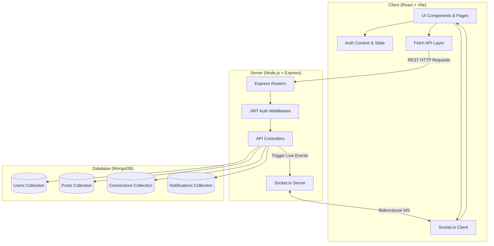

<div align="center">

  <h1>
     Waverly
  </h1>

  <p><strong>A Modern, Real-Time Professional & Alumni Networking Platform</strong></p>

[](https://react.dev/)
[](https://nodejs.org/)
[](https://expressjs.com/)
[](https://www.mongodb.com/)
[](https://socket.io/)
[](https://vitejs.dev/)
[](LICENSE)

[Key Features](#-key-features) •
[Tech Stack](#-tech-stack) •
[System Architecture](#-system-architecture) •
[Getting Started](#-getting-started) •
[API Reference](#-api-reference) •
[Socket Events](#-real-time-socket-events)

</div>

---

## 📖 Overview

**Waverly** is a full-stack professional networking platform designed to connect students, alumni, and industry professionals. Built with the **MERN** stack (MongoDB, Express, React, Node.js) and powered by **Socket.io**, Waverly enables seamless discovery, authentic community engagement, rich media publishing, multi-level threaded discussions, and real-time alerts.

---

## ✨ Key Features

### 🔐 Authentication & Profile Management
- **JWT-Secured Authentication**: Secure token-based registration and login with bcrypt-hashed credentials.
- **Comprehensive Profiles**: Customizable banners, avatars, bios, about sections, listed skills, education, company affiliations, and locations.
- **Profile Viewer Analytics**: Real-time tracking and logging of profile views so users know who visited their profile.
- **Organization & Alumni Directories**: Explore members and peers filtered by college, company, or city.

### 📰 Feed & Interactive Discussions
- **Rich Post Creation**: Share thoughts, announcements, and image attachments with global or network feeds.
- **Multi-Level Threaded Conversations**: Full support for nested comments, replies to comments, and individual comment/reply liking.
- **Curated Activity Feeds**: Filter and review personal activity with dedicated views for **Liked Posts**, **Saved Posts**, and **Commented Posts**.

### 👥 Network Building & Discovery
- **Connection Lifecycle**: Send, receive, accept, or reject connection requests with real-time notifications.
- **Smart Recommendations**: Suggests relevant peers based on shared colleges, companies, skills, and mutual ties.
- **Connection Insights**: View comprehensive network statistics and directory overviews.

### ⚡ Real-Time Engine (Socket.io)
- **Instant Notification Toasts**: Real-time popups and badges for likes, comments, replies, profile visits, and connection actions.
- **Live Notifications Center**: Manage, mark as read, respond to, or clear notifications on the fly.

### 🔍 Global Instant Search
- Search across people, organizations, colleges, and posts with instant feedback.

---

## 🛠 Tech Stack

| Layer | Technologies |
| :--- | :--- |
| **Frontend** | React 19, React Router DOM v7, Vite, Socket.io Client, Modern Vanilla CSS Design System |
| **Backend** | Node.js, Express 5.x, Socket.io, JSON Web Tokens (`jsonwebtoken`), `bcrypt` |
| **Database** | MongoDB with Mongoose ODM (Indexes, Schemas, Aggregations) |
| **Tooling & Dev** | Nodemon, ESLint, Dotenv, Cors |

---

## 🏗 System Architecture



---

## 📁 Project Structure

```
Waverly/
├── client/                     # Frontend Application (React + Vite)
│   ├── src/
│   │   ├── assets/             # Static visual assets
│   │   ├── components/         # Reusable UI components (PostCard, Navbar, ProfileHeader, etc.)
│   │   ├── context/            # Global state (AuthContext, etc.)
│   │   ├── pages/              # Routed views (Feed, Profile, Network, Notifications, Search, etc.)
│   │   ├── routes/             # Protected routing logic
│   │   ├── services/           # API fetch client & Socket instance
│   │   ├── utils/              # Helper utilities
│   │   ├── App.jsx             # Main routing configuration
│   │   ├── index.css           # Global stylesheet and design system
│   │   └── main.jsx            # React root entry
│   ├── package.json
│   └── vite.config.js          # Vite config & proxy definitions
│
└── server/                     # Backend Application (Node.js + Express + Socket.io)
    ├── src/
    │   ├── config/             # DB connection & server configurations
    │   ├── controllers/        # Route controllers (Auth, User, Post, Search, Notification)
    │   ├── middleware/         # Authentication & security middleware
    │   ├── models/             # Mongoose schemas (User, Post, Connection, Notification)
    │   ├── routes/             # REST API endpoint definitions
    │   ├── socket.js           # Socket.io initialization & event dispatchers
    │   └── utils/              # Server-side utility functions
    ├── server.js               # Express application and HTTP server setup
    └── package.json
```

---

## 🚀 Getting Started

### Prerequisites

- [Node.js](https://nodejs.org/) (v18+ recommended)
- [MongoDB](https://www.mongodb.com/) (Local instance or MongoDB Atlas cluster)
- `npm` or `yarn`

---

### Installation & Setup

#### 1. Clone the repository
```bash
git clone https://github.com/Exploring-glitch/Waverly.git
cd Waverly
```

#### 2. Configure Environment Variables

Create a `.env` file in the `server` directory:

```bash
# In server/.env
PORT=3000
MONGODB_URI=mongodb://localhost:27017/waverly
JWT_SECRET=your_super_secret_jwt_key
CLIENT_URL=http://localhost:5173
```

*(Optional)* If configuring client-side environment overrides, create `client/.env`:
```bash
# In client/.env
VITE_API_URL=http://localhost:3000
```

---

#### 3. Install Server Dependencies & Start Backend
```bash
cd server
npm install
npm run dev
```
> The backend server will start on `http://localhost:3000` (or your configured `PORT`).

---

#### 4. Install Client Dependencies & Start Frontend
In a new terminal window:
```bash
cd client
npm install
npm run dev
```
> The Vite development server will start at `http://localhost:5173`.

---

## 📡 API Reference

### 🔑 Authentication (`/api/auth`)
| Method | Endpoint | Description | Auth Required |
| :--- | :--- | :--- | :---: |
| `POST` | `/api/auth/register` | Register a new user | ❌ |
| `POST` | `/api/auth/login` | Log in and receive JWT | ❌ |
| `GET` | `/api/auth/me` | Fetch authenticated user data | ✅ |

### 👤 Users & Networking (`/api/users`)
| Method | Endpoint | Description | Auth Required |
| :--- | :--- | :--- | :---: |
| `GET` | `/api/users/profile` | Get current user's profile | ✅ |
| `PUT` | `/api/users/profile` | Update user profile details | ✅ |
| `GET` | `/api/users/:username` | Retrieve public user profile | ✅ |
| `GET` | `/api/users/recommend` | Get recommended connections | ✅ |
| `GET` | `/api/users/stats` | Retrieve network & connection stats | ✅ |
| `GET` | `/api/users/profile-viewers`| Get users who viewed the profile | ✅ |
| `POST` | `/api/users/connect/:userId` | Send a connection request | ✅ |
| `POST` | `/api/users/connect/accept/:senderId` | Accept connection request | ✅ |
| `POST` | `/api/users/connect/reject/:targetUserId`| Reject connection request | ✅ |
| `GET` | `/api/users/connect/requests/received` | List received connection requests | ✅ |
| `GET` | `/api/users/connect/requests/sent` | List sent connection requests | ✅ |
| `GET` | `/api/users/college/:name/members` | Get members by college | ✅ |
| `GET` | `/api/users/company/:name/members` | Get members by company | ✅ |
| `GET` | `/api/users/city/:name/members` | Get members by city | ✅ |

### 📝 Posts & Comments (`/api/posts`)
| Method | Endpoint | Description | Auth Required |
| :--- | :--- | :--- | :---: |
| `GET` | `/api/posts` | Get all feed posts | ✅ |
| `POST` | `/api/posts` | Create a new post | ✅ |
| `GET` | `/api/posts/me` | Get posts authored by current user | ✅ |
| `GET` | `/api/posts/user/:username` | Get posts by username | ✅ |
| `PUT` | `/api/posts/:id` | Edit post content | ✅ |
| `DELETE` | `/api/posts/:id` | Delete a post | ✅ |
| `POST` | `/api/posts/:id/like` | Like or unlike a post | ✅ |
| `POST` | `/api/posts/:id/comment` | Add comment to post | ✅ |
| `PUT` | `/api/posts/:id/comments/:commentId` | Edit comment | ✅ |
| `DELETE` | `/api/posts/:id/comments/:commentId` | Delete comment | ✅ |
| `POST` | `/api/posts/:id/comments/:commentId/reply` | Reply to a comment | ✅ |
| `POST` | `/api/posts/:id/comments/:commentId/replies/:replyId/like` | Like or unlike a reply | ✅ |

### 🔔 Notifications (`/api/notifications`)
| Method | Endpoint | Description | Auth Required |
| :--- | :--- | :--- | :---: |
| `GET` | `/api/notifications` | Fetch user notifications | ✅ |
| `GET` | `/api/notifications/unread-count` | Get count of unread notifications | ✅ |
| `PUT` | `/api/notifications/read-all` | Mark all notifications as read | ✅ |
| `PUT` | `/api/notifications/:id/read` | Mark single notification as read | ✅ |
| `DELETE` | `/api/notifications/:id` | Remove a notification | ✅ |
| `DELETE` | `/api/notifications` | Clear all notifications | ✅ |

### 🔍 Search (`/api/search`)
| Method | Endpoint | Description | Auth Required |
| :--- | :--- | :--- | :---: |
| `GET` | `/api/search?q=query&type=all` | Global multi-category search | ✅ |

---

## ⚡ Real-Time Socket Events

| Event Name | Direction | Payload | Description |
| :--- | :--- | :--- | :--- |
| `register_user` | Client ➔ Server | `userId` | Joins the authenticated user's private socket room |
| `notification` | Server ➔ Client | `Notification Object` | Dispatches real-time notification toasts and inbox updates |

---

## 🤝 Contributing

Contributions make the open-source community an amazing place to learn, inspire, and create. Any contributions you make are **greatly appreciated**.

1. Fork the Project
2. Create your Feature Branch (`git checkout -b feature/AmazingFeature`)
3. Commit your Changes (`git commit -m 'Add some AmazingFeature'`)
4. Push to the Branch (`git push origin feature/AmazingFeature`)
5. Open a Pull Request

---

## 📄 License

This project is licensed under the **ISC License**. See the `LICENSE` file for details.

<div align="center">
  <sub>Built with ❤️ by the Waverly Team</sub>
</div>
